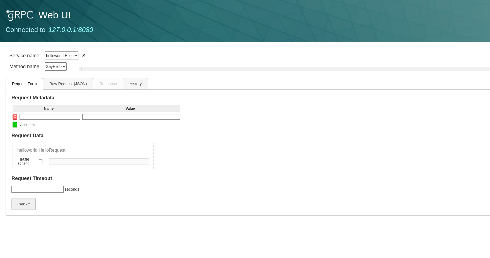
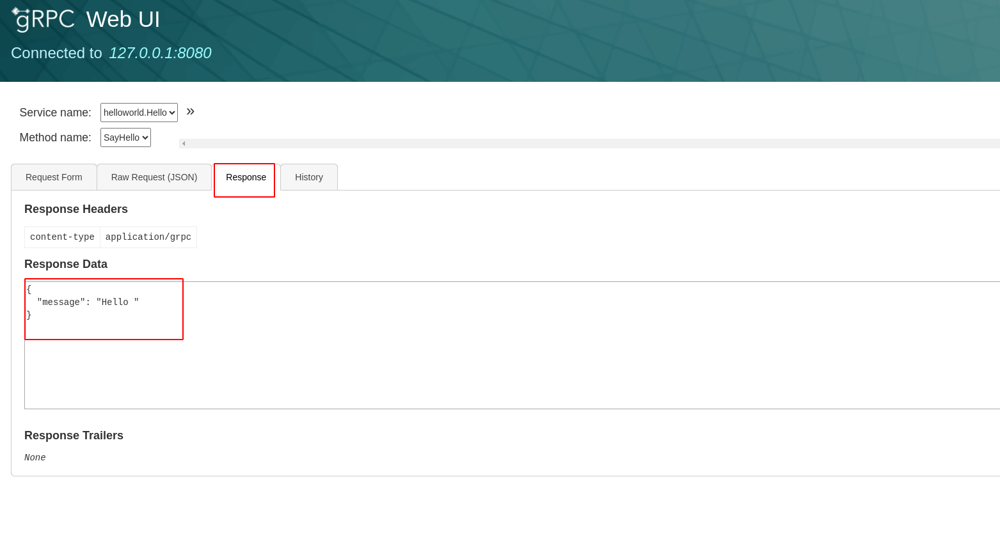

# grpc系列课程（五）：grpc调试工具

> 开发环境：
> 
> 系统： ubuntu20.04
> 
> go版本： 1.19
>
> 编辑器： goland

平时我们编写http的api接口时能够很方便的通过postman工具进行接口调试，那么grpc接口是否也有类似postman的工具可以调试呐？
当然可以，github上有一款工具[grpcui](https://github.com/fullstorydev/grpcui)，专门用来在浏览器中进行grpc接口调试。

## 安装grpcui工具

```bash
$ go install github.com/fullstorydev/grpcui/cmd/grpcui@latest
```

## 项目测试

我们以``demo_1``测试代码为例进行调试。首先在项目中安装依赖：

```bash
$ go get github.com/fullstorydev/grpcui
```

### 运行项目

```bash
$ go run server/main.go
```

### 启动grpcui

另起一个终端，执行一下命令，注意这里的端口号要和grpc服务端口号保持一致。

```bash
$ grpcui -plaintext 127.0.0.1:8080
```

如果你在执行以上命令的时候出现一下报错：

```text
Failed to compute set of methods to expose: server does not support the reflection API
```

需要在``server/main.go``文件中添加如下代码，增加反射：

```go
reflection.Register(s)
```

此时再运行以上启动grpcui命令，可看到一下输出：

```text
gRPC Web UI available at http://127.0.0.1:41619/
Opening in existing browser session.
```

## 浏览器调试

浏览器打开``http://127.0.0.1:41619/`` ,可以看到grpcui调试页面：


点击``Invoke``按钮，可以看到``Response``tab页有对于的相应数据：

