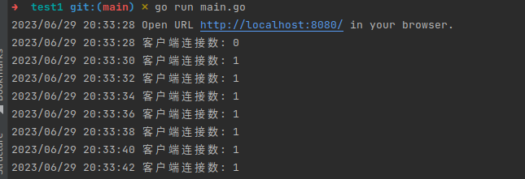
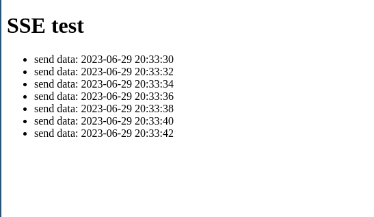

# 用go开发sse接口

> 开发环境：
>
> 系统： ubuntu20.04
>
> go版本： 1.19
>
> 编辑器： goland

sse 服务器发送事件(Server-Sent Events)，服务端向客户端单向传递消息。在一些只需要接受服务端数据的需求中可以取代websocket技术，使用起来也很简单。

目前go已经有一些支持sse的库，我这里选用了：``eventsource.v1``

```shell
$ go get gopkg.in/antage/eventsource.v1
```

## 广播模式SSE

广播模式SSE指不设置事件名，或者说是不设置通道，所有客户端接收同样的数据。

具体代码实现如下：[点击查看源码](https://github.com/silenceboychen/gostudy/tree/main/demo_6/test1)

**服务端**

```go
package main

import (
	"fmt"
	"gopkg.in/antage/eventsource.v1"
	"log"
	"net/http"
	"time"
)

// 广播模式SSE，不设置事件名称（也可理解为通道）
func main() {
	es := eventsource.New(nil, nil)
	defer es.Close()

	http.Handle("/", http.FileServer(http.Dir("./public")))
	http.Handle("/events", es)
	go func() {
		for {
			// 只设置发送数据，不添加事件名
			es.SendEventMessage(fmt.Sprintf("send data: %s", time.Now().Format("2006-01-02 15:04:05")), "", "")
			log.Printf("客户端连接数: %d", es.ConsumersCount())
			time.Sleep(2 * time.Second)
		}
	}()

	log.Println("Open URL http://localhost:8080/ in your browser.")
	err := http.ListenAndServe(":8080", nil)
	if err != nil {
		log.Fatal(err)
	}
}
```

**前端**

```html
<!DOCTYPE html>
<html>
<head>
    <title>SSE test</title>
    <script type="text/javascript">
        const es = new EventSource("http://localhost:8080/events");
        es.onmessage = function (e) {
            document.getElementById("test")
                .insertAdjacentHTML("beforeend", "<li>" + e.data + "</li>");
        }
        es.onerror = function (e) {
            // readyState说明
            // 0：浏览器与服务端尚未建立连接或连接已被关闭
            // 1：浏览器与服务端已成功连接，浏览器正在处理接收到的事件及数据
            // 2：浏览器与服务端建立连接失败，客户端不再继续建立与服务端之间的连接
            console.log("readyState = " + e.currentTarget.readyState);
        }
    </script>
</head>
<body>
<h1>SSE test</h1>
<div>
    <ul id="test">
    </ul>
</div>
</body>
</html>
```

启动服务端代码：

```shell
$ go run main
```

打开浏览器访问前端代码： http://localhost:8080

服务端输出：



前端输出：



## 点对点模式SSE

[点击查看源代码](https://github.com/silenceboychen/gostudy/tree/main/demo_6/test2)

实现方式和广播模式差不多，只需做简单修改：

服务端代码只需添加事件名称：

```go
// 设置事件名称为：test-event
es.SendEventMessage(fmt.Sprintf("send data: %s", time.Now().Format("2006-01-02 15:04:05")), "test-event", "")
```

前端代码修改接收方式：

```javascript
es.addEventListener("test-event", (e) => {
    document.getElementById("test")
        .insertAdjacentHTML("beforeend", "<li>" + e.data + "</li>");
});
```

## 支持跨域的SSE

[点击查看源代码](https://github.com/silenceboychen/gostudy/tree/main/demo_6/test3)

现在项目开发基本上都是前后端分离，这样就会存在跨域问题，SSE解决跨域的方式只需要在``new``方法内增加允许跨域请求头：

```go
es := eventsource.New(
    eventsource.DefaultSettings(),
    func(req *http.Request) [][]byte {
        return [][]byte{
            []byte("X-Accel-Buffering: no"),
            []byte("Access-Control-Allow-Origin: *"),
        }
    })
```

前端创建sse连接时也可添加允许跨域参数：

[点击查看源代码](https://github.com/silenceboychen/gostudy/tree/main/demo_6/test4)

```javascript
const es = new EventSource("http://localhost:8080/events", { withCredentials: true });
```

## 解决火狐浏览器断开不会自动重连问题

在Chrome浏览器中sse断开后会自动重连，但firefox浏览器中断开后不会重连，解决办法是，前端js通过判断连接状态主动进行重连请求，通过判断readyState的值进行重新调用初始化操作

readyState说明：
* 0：浏览器与服务端尚未建立连接或连接已被关闭
* 1：浏览器与服务端已成功连接，浏览器正在处理接收到的事件及数据
* 2：浏览器与服务端建立连接失败，客户端不再继续建立与服务端之间的连接

前端代码可修改为如下：

```html
<!DOCTYPE html>
<html>
<head>
    <title>SSE test</title>
    <script type="text/javascript">
        let es = null;
        // 解决火狐浏览器断开不会自动重连问题
        function initES() {
            if (es == null || es.readyState == 2) {
                es = new EventSource("http://localhost:8080/events", {withCredentials: true});
                es.addEventListener("test-event", (e) => {
                    document.getElementById("test")
                        .insertAdjacentHTML("beforeend", "<li>" + e.data + "</li>");
                });
                es.onerror = function (e) {
                    // readyState说明
                    // 0：浏览器与服务端尚未建立连接或连接已被关闭
                    // 1：浏览器与服务端已成功连接，浏览器正在处理接收到的事件及数据
                    // 2：浏览器与服务端建立连接失败，客户端不再继续建立与服务端之间的连接
                    console.log("readyState = " + e.currentTarget.readyState);
                    if (es.readyState == 2) {
                        setTimeout(initES, 5000)
                    }
                }
            }
        }
        initES()
    </script>
</head>
<body>
<h1>SSE test</h1>
<div>
    <ul id="test">
    </ul>
</div>
</body>
</html>
```